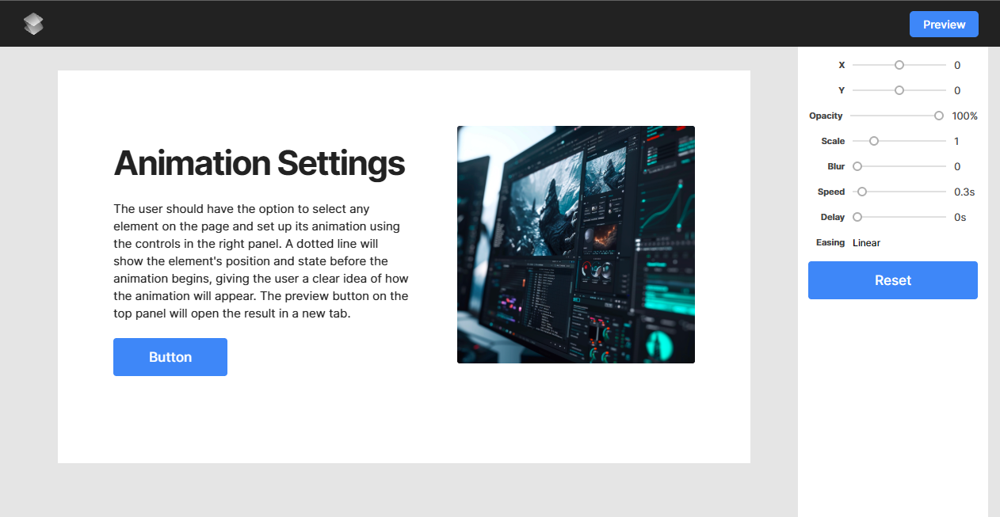

# React Animator

Приложение позволяет выбирать элементы на странице, настраивать для них CSS-анимации, просматривать результат и сохранять настройки между перезагрузками страницы.

## 📸 Скриншот

## 📋 О проекте

Задача заключалась в создании React-приложения по предоставленному дизайн-макету.

Основной сценарий работы пользователя:

1. Выбрать элемент в рабочей области.
2. Настроить параметры его анимации в правой панели.
3. Выбрать подходящий вариант `easing`.
4. Запустить Preview и посмотреть результат.
5. Перезагрузить страницу и продолжить работу с сохранёнными настройками.

При реализации основное внимание уделялось соответствию предоставленному дизайну, удобству взаимодействия и разделению приложения на переиспользуемые React-компоненты.

## ✨ Реализованный функционал

### Выбор элементов

Пользователь может выбрать любой доступный элемент в рабочей области.

Выбранный элемент визуально выделяется, а его текущие параметры анимации отображаются в правой панели настроек.

### Настройка анимации

Для каждого выбранного элемента доступны следующие параметры:

| Параметр    | Описание                         |
| ----------- | -------------------------------- |
| **X**       | Смещение элемента по горизонтали |
| **Y**       | Смещение элемента по вертикали   |
| **Opacity** | Изменение прозрачности элемента  |
| **Scale**   | Изменение масштаба элемента      |
| **Blur**    | Степень размытия элемента        |
| **Speed**   | Скорость выполнения анимации     |
| **Delay**   | Задержка перед запуском анимации |
| **Easing**  | Функция плавности анимации       |

Все параметры можно изменять непосредственно из панели управления.

### Easing

Для параметра `Easing` реализован набор вариантов плавности анимации.

Доступны, в частности:

- `Linear`
- `Ease`
- `Ease In`
- `Ease Out`
- `Ease In Out`
- `Step-end`

### Preview

Кнопка **Preview** переводит приложение в режим предварительного просмотра.

В этом режиме пользователь может увидеть, как настроенные параметры влияют на анимацию элементов.

После завершения просмотра можно вернуться в режим редактирования и продолжить настройку.

### Сохранение настроек

Настройки анимации сохраняются в `localStorage`.

Для каждого элемента сохраняется его собственная конфигурация:
